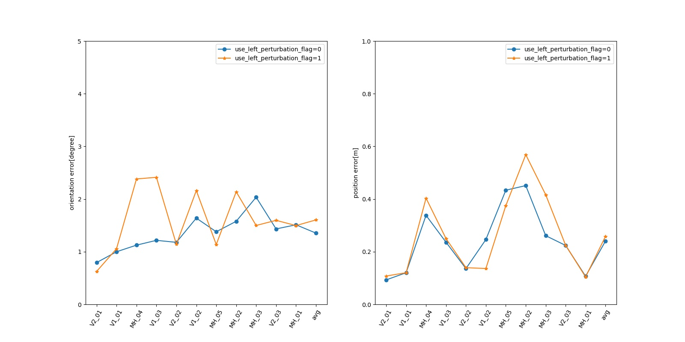

# OrcVIO evaluation on EuROC dataset
NOTE: we log the RMSE of orientation and postion. Unit: [deg, m]
## Single param comparision
|use_left_perturbation_flag|V2_01|V1_01|MH_04|V1_03|V2_02|V1_02|MH_05|MH_02|MH_03|V2_03|MH_01|avg|
|--|--|--|--|--|--|--|--|--|--|--|--|--|
|0|0.79,0.09|1.00,0.12|1.12,0.34|1.22,0.24|1.18,0.14|1.64,0.25|1.38,0.43|1.58,0.45|2.03,0.26|1.43,0.22|1.51,0.11|1.35,0.24|
|1|0.63,0.11|1.06,0.12|2.38,0.40|2.41,0.25|1.14,0.14|2.16,0.14|1.14,0.37|2.14,0.57|1.50,0.42|1.60,0.22|1.50,0.10|1.60,0.26|

