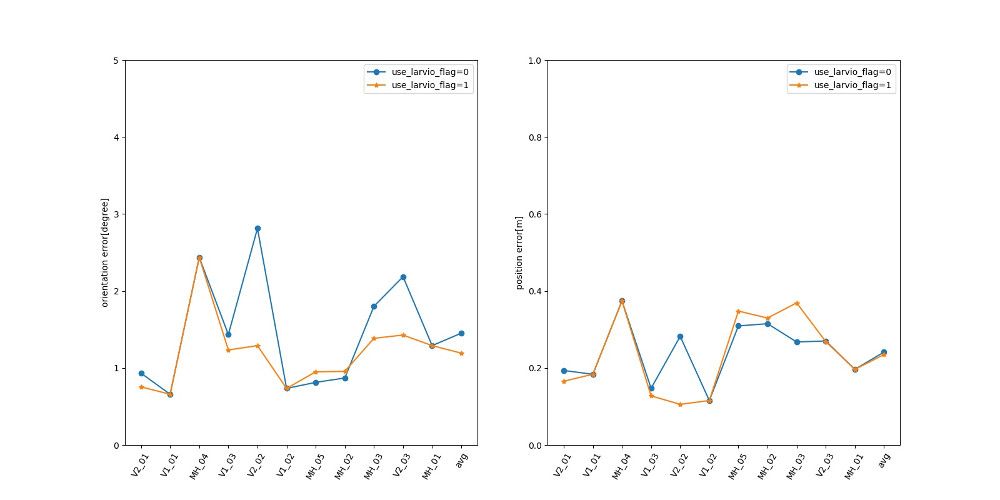

# OrcVIO evaluation on EuROC dataset
NOTE: we log the RMSE of orientation and postion. Unit: [deg, m]
## Single param comparision
|use_larvio_flag|V2_01|V1_01|MH_04|V1_03|V2_02|V1_02|MH_05|MH_02|MH_03|V2_03|MH_01|avg|
|--|--|--|--|--|--|--|--|--|--|--|--|--|
|0|0.93,0.19|0.66,0.18|2.44,0.37|1.43,0.15|2.81,0.28|0.73,0.12|0.81,0.31|0.87,0.32|1.80,0.27|2.19,0.27|1.29,0.20|1.45,0.24|
|1|0.75,0.17|0.66,0.18|2.44,0.37|1.23,0.13|1.29,0.11|0.73,0.12|0.95,0.35|0.96,0.33|1.39,0.37|1.43,0.27|1.29,0.20|1.19,0.23|

